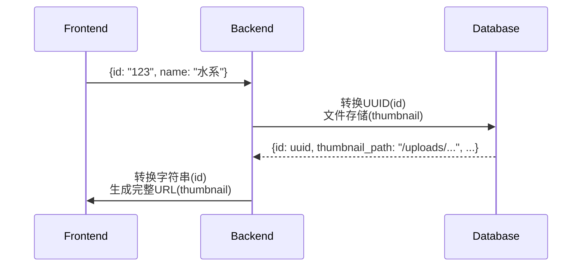

# 分类数据模型

## 前端类型定义
```typescript
// pokedex_frontend/src/types/index.ts:15-22
interface Category {
  id: string;
  name: string;
  description?: string;
  thumbnailUrl: string;
  createdDate: string;
}
```

## 后端模型定义
```python
# pokedex_backend/app/models/category_models.py:23-45
class CategoryCreate(BaseModel):
    name: str = Field(..., max_length=50)
    description: Optional[str] = Field(None, max_length=300)
    thumbnail: UploadFile

class CategoryDB(CategoryBase):
    id: UUID
    thumbnail_path: str = Field(..., alias="thumbnail_url")
    created_at: datetime
```

## 模型转换规范


## 字段映射表
| 前端字段 | 后端字段     | 转换规则                     |
|----------|--------------|------------------------------|
| id       | id           | 字符串 ↔ UUID 双向转换       |
| thumbnailUrl | thumbnail_path | 路径转完整URL（前端拼接CDN地址） |
| createdDate | created_at | ISO时间字符串 ↔ datetime对象 |
