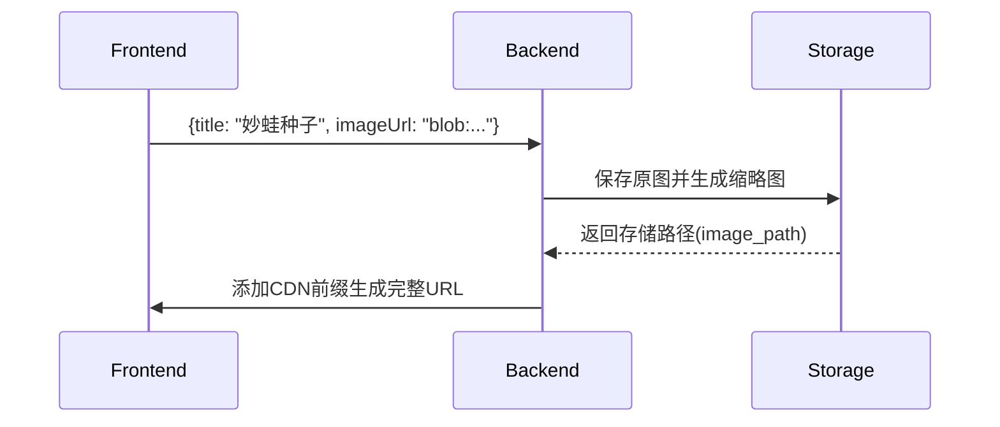

# 图片数据模型

## 前端类型定义
```typescript
// pokedex_frontend/src/types/index.ts:24-35
interface Image {
  id: string;
  title: string;
  description: string;
  imageUrl: string;
  categoryId: string;
  createdDate: string;
  metadata: {
    width: number;
    height: number;
    fileSize: string;
  };
}
```

## 后端模型定义
```python
# pokedex_backend/app/models/image_models.py:18-42
class ImageCreate(BaseModel):
    title: str = Field(..., max_length=100)
    description: str = Field(..., max_length=500)
    image_file: UploadFile
    category_id: UUID

class ImageDB(ImageBase):
    id: UUID
    image_path: str
    category_id: UUID
    created_at: datetime
    metadata: Json = Field(
        default={},
        sa_column=Column(JSONB(none_as_null=True))
    )
```

## 模型转换规范


## 字段映射表
| 前端字段 | 后端字段     | 转换规则                     |
|----------|--------------|------------------------------|
| imageUrl | image_path   | 路径转完整URL（前端拼接CDN地址） |
| categoryId | category_id | 字符串 ↔ UUID 双向转换       |
| metadata | metadata     | JSON序列化/反序列化          |
