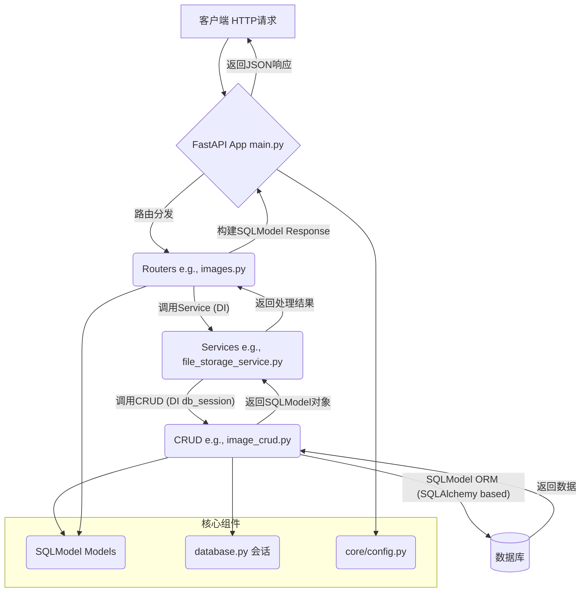

# pokedex_backend 文档

## 1. 技术栈

*   **框架**: FastAPI (现代、快速的 Python Web 框架)
*   **ORM 与数据模型**: SQLModel (基于 Pydantic 和 SQLAlchemy，统一数据模型、校验和数据库交互)
*   **数据校验/序列化**: Pydantic (SQLModel 内置支持)
*   **数据库**: PostgreSQL / MySQL (或任何 SQLAlchemy 支持的关系型数据库)
*   **ASGI 服务器**: Uvicorn (运行 FastAPI 应用)
*   **依赖管理**: Pip (通过 `requirements.txt`)
*   **版本控制**: Git

## 2. 总体框架

`pokedex_backend` 是一个基于 FastAPI 的 Python 后端，提供宝可梦图鉴 API。它采用分层架构：HTTP 请求由 FastAPI 处理，通过 Service 层进行业务逻辑，CRUD 层执行数据操作，SQLModel (及其底层的 SQLAlchemy) 与数据库交互，最终返回 JSON 响应。

关键目录/文件:

*   **`main.py`**: 应用入口，初始化 FastAPI、数据库连接 (可能调用 `create_db_and_tables`)、中间件、路由。
*   **`database.py`**: SQLModel 引擎 (`engine`) 定义，数据库会话管理 (如 `get_session` 依赖项)。
*   **`models/`**: SQLModel 模型定义，每个模型同时是 Pydantic 模型和 SQLAlchemy 表映射。
*   **`crud/`**: 数据访问操作 (CRUD)，使用 SQLModel 与数据库交互。
*   **`routers/`**: API 路由 (`APIRouter`) 定义，调用 Service 层，使用 SQLModel 进行请求/响应校验。
*   **`services/`**: 业务逻辑封装，协调 CRUD 操作和外部服务。
*   **`core/`**: 核心配置 (`config.py` 使用 Pydantic `BaseSettings`) 和工具。
*   **`static/`**: 存放由 FastAPI 直接服务的静态文件。
*   **`requirements.txt`**: Python 依赖列表。
*   **`design.md`**: 项目设计文档。

## 3. 模块详细讲解

*   **`main.py`**: 初始化 FastAPI 实例；配置 CORS；注册 `routers`；处理应用生命周期事件 (如 `startup` 时调用 `create_db_and_tables` 来创建基于 SQLModel 的表)。

*   **`database.py`**: 定义 SQLModel `engine` (基于 SQLAlchemy `engine`，通过 `DATABASE_URL` 配置)，并提供管理数据库会话的 FastAPI 依赖项 (例如 `get_session()`)。可能包含创建数据库表 (如 `create_db_and_tables`) 的函数 (如果不在 `main.py`)。

*   **`models/` (SQLModel 模型)**: 每个模型文件 (e.g., `category_models.py`) 定义继承自 `SQLModel` 的类。
    *   `Category` 模型 (e.g., `id`, `name`, `description`).
    *   `Image` 模型 (e.g., `id`, `filename`, `file_path`, `url`, `uploaded_at`, 外键，通过 `Relationship` 定义关联)。
    *   `SpeciesInfo` 模型 (e.g., `id`, `pokedex_id`, `name`, `types`, `description`).

*   **`crud/` (数据访问层)**: 针对各 SQLModel 模型提供 CRUD 函数。接收数据库会话 (`Session` from `get_session`) 和 SQLModel 实例 (用于数据创建/更新)，返回 SQLModel 实例或列表。
    *   例如 `image_crud.py` 包含 `create_image`, `get_image`, `get_images` (分页), `update_image`, `delete_image`。

*   **`routers/` (API路由层)**: 使用 `APIRouter`。通过 `Depends` 注入数据库会话和 Service。输入和输出使用 SQLModel 模型进行数据校验和序列化 (请求体为 `SomeSQLModelCreate`, 响应体为 `SomeSQLModelRead`)。
    *   `images.py`: 处理图片上传、获取、更新、删除。
    *   `categories.py` 和 `species_info_router.py`: 分别处理分类和物种信息的 API 请求。

*   **`services/` (业务逻辑层)**:
    *   `file_storage_service.py`: 处理文件保存、URL 构建、文件删除。
    *   `image_processing_service.py`: 图片处理逻辑 (可能使用 Pillow/Wand)。

*   **`core/config.py`**: 使用 Pydantic `BaseSettings` 从环境变量或 `.env` 文件加载配置。

*   **`requirements.txt`**: 关键依赖 `fastapi`, `uvicorn`, `sqlmodel`, `psycopg2-binary` (或 `mysqlclient`), `python-multipart`。

## 4. Mermaid 流程图 (简化请求流程)

