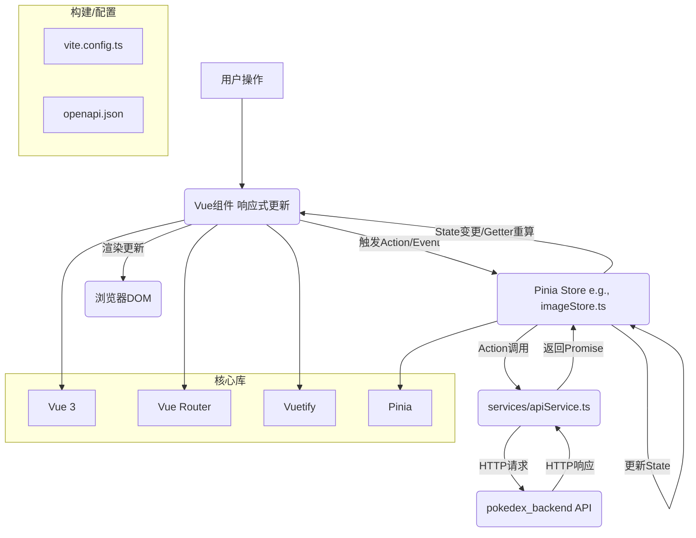

# pokedex_frontend 文档

## 1. 技术栈

*   **核心框架**: Vue 3 (组合式 API)
*   **构建工具**: Vite (快速的现代前端构建工具)
*   **语言**: TypeScript
*   **状态管理**: Pinia (Vue官方推荐的状态管理库)
*   **UI 框架**: Vuetify 3 (Material Design 组件库)
*   **路由**: Vue Router (官方路由管理器，手动配置路由)
*   **HTTP客户端**: Axios (或原生 Fetch API，用于与后端 API 交互)
*   **包管理器**: PNPM (或 NPM/Yarn)
*   **API 规范**: OpenAPI (Swagger) (通过 `openapi.json` 定义后端接口)
*   **Vite 插件 (示例)**:
    *   `vite-plugin-vue-components` (或 `unplugin-vue-components`): 组件按需自动导入。
    *   `unplugin-auto-import`: API (如 Vue/Pinia 函数) 按需自动导入。
    *   `vite-plugin-vue-layouts`: 支持布局组件。
    *   `vite-plugin-vuetify`: Vuetify 集成。

## 2. 总体框架

`pokedex_frontend` 是一个基于 Vue 3、Vite 和 TypeScript 的 SPA (单页面应用)。它通过 Pinia 管理状态，Vuetify 构建 UI，Vue Router 处理导航 (在 `src/plugins/router/routes.ts` 中手动定义路由)，并通过 Axios/Fetch 调用 `pokedex_backend` API 展示宝可梦数据。

关键目录/文件:

*   **`index.html`**: SPA 主入口，包含 Vue 挂载点 `
`。
*   **`package.json`**: 定义 NPM 脚本 (`dev`, `build`) 和依赖。
*   **`vite.config.ts`**: Vite 配置 (插件、路径别名 `@/`、开发服务器代理)。
*   **`tsconfig.json`**: TypeScript 编译器配置。
*   **`src/`**: 源代码核心。
    *   **`main.ts`**: Vue 应用入口，创建实例，注册插件 (Pinia, Router, Vuetify)，挂载应用。
    *   **`App.vue`**: 根 Vue 组件，通常包含 `<router-view>`。
    *   **`components/`**: 可复用 UI 组件 (e.g., `PokemonCard.vue`)。
    *   **`pages/`**: 存放页面级组件 (e.g., `dashboard.vue`, `[...error].vue`)，由路由手动映射。
    *   **`layouts/`**: 布局组件 (e.g., `default.vue` 包含导航栏和页脚)。
    *   **`plugins/`**: Vue 插件初始化 (Router, Pinia, Vuetify)。
        *   `router/index.ts` 与 `router/routes.ts`: 创建和配置 Vue Router 实例及手动定义路由规则。
    *   **`store/`**: Pinia 状态模块 (e.g., `imageStore.ts`)，管理状态、actions、getters。
    *   **`services/apiService.ts`**: API 服务，封装后端交互逻辑 (使用 Axios/Fetch)。
    *   **`assets/`**: 静态资源 (全局 SASS/CSS, 图片)。
    *   **`types/`**: TypeScript 类型定义 (接口，部分可从 `openapi.json` 生成)。
    *   **`utils/`**: 通用工具函数。
*   **`public/`**: Vite 不处理的纯静态资源 (e.g., `favicon.ico`)。
*   **`openapi.json`**: 后端 API 的 OpenAPI 规范。

## 3. 模块详细讲解

*   **`main.ts`**: 创建 Vue 应用 (`createApp(App)`), 依次 `.use()` 注册 Router, Pinia, Vuetify 实例, 最后 `.mount('#app')`。

*   **`App.vue`**: 根组件，通常只包含 `<router-view />` 以渲染当前路由的页面组件。

*   **`components/`**: 存放原子化、可复用的UI组件。例如 `PokemonCard.vue` 用于展示宝可梦摘要，通过 props 接收数据。

*   **`layouts/`**: 定义页面骨架。`default.vue` 可能使用 Vuetify 的 `v-layout`, `v-app-bar`, `v-main`, `v-footer` 组织页面结构。

*   **`pages/`**: 页面级组件。例如 `dashboard.vue` 负责展示列表和筛选；`[...error].vue` 用于捕获未匹配的路由。这些组件在 `src/plugins/router/routes.ts` 中被引用。

*   **`plugins/`**:
    *   `router/index.ts` 和 `router/routes.ts`: `createRouter({ history: createWebHistory(), routes })`，其中 `routes` 从 `routes.ts` 导入，包含手动定义的路由对象数组。
    *   `pinia.ts`: `createPinia()` 并导出，可能包含 Pinia 插件。
    *   `vuetify/index.ts`: `createVuetify()`，配置主题 (`theme.ts`)、图标 (`icons.ts`)、组件默认值 (`defaults.ts`)。

*   **`store/` (Pinia)**: 每个 store (e.g., `imageStore.ts`) 定义 `state` (响应式数据), `getters` (计算属性), `actions` (方法，可异步，调用 `apiService`)。

*   **`services/apiService.ts`**: 创建并配置 Axios 实例 (设置 `baseURL` 从 `import.meta.env.VITE_API_BASE_URL`)。提供如 `getPokemonList()`, `uploadImage()` 等异步函数，返回 Promise，类型基于 `types/`。

*   **`types/`**: TypeScript 接口和类型别名，用于定义数据结构，确保类型安全，例如 `interface Pokemon { ... }`。

*   **`vite.config.ts`**: 核心是 `plugins` 数组 (vue(), vuetify(), Components(), AutoImport(), Layouts()) 和 `resolve.alias` (`@` 指向 `src/`)。开发时 `server.proxy` 用于API转发。

## 4. Mermaid 流程图 (简化交互与数据流)

