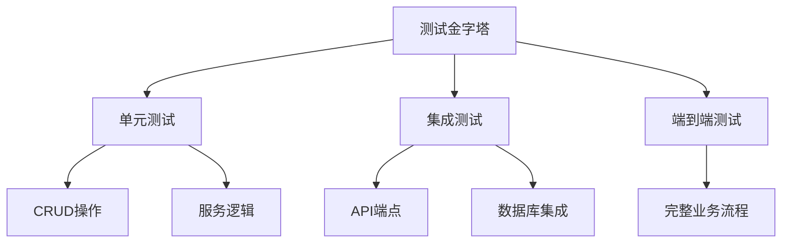
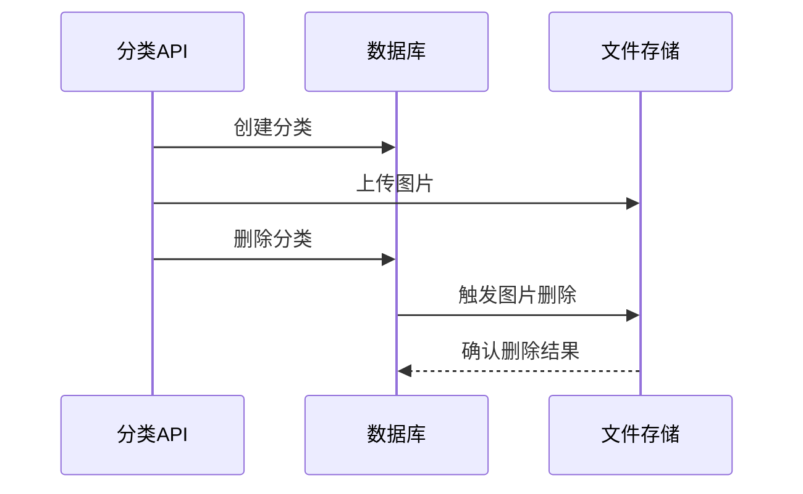
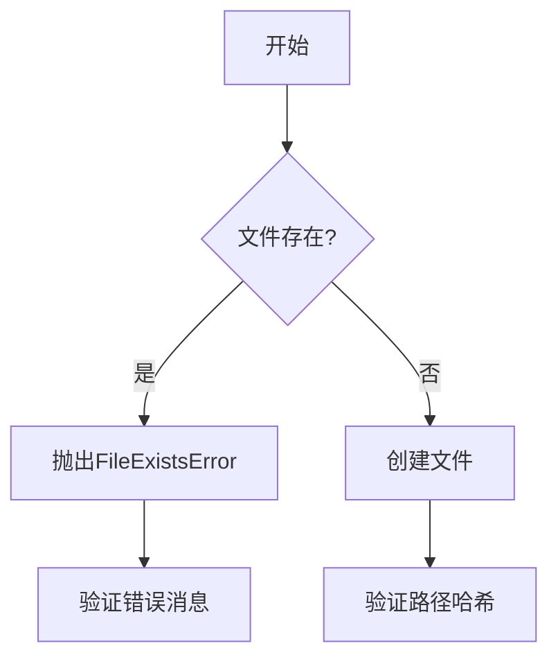

# 自动化测试实施方案

## 测试策略与架构



## 测试工具链

| 工具名称             | 用途说明                     | 版本要求   |
|----------------------|----------------------------|-----------|
| pytest               | 测试框架和执行器            | >=7.0     |
| fastapi.TestClient    | API端点测试客户端           | 随FastAPI版本 |
| SQLModel             | 数据库模型和会话管理         | >=0.0.8   |
| coverage.py          | 测试覆盖率统计               | >=6.0     |
| pytest-mock          | Mock对象管理                | >=3.10    |
| python-multipart     | 文件上传测试支持             | >=0.0.6   |

## 依赖管理

### 测试专用依赖文件
```bash
tests/requirements.txt
```

### 依赖安装命令
```bash
# 安装测试依赖
pip install -r tests/requirements.txt

# 仅安装测试依赖（开发环境）
pip install -r tests/requirements.txt --user
```

## 测试目录结构

```bash
tests/
└── backend/
    ├── unit/               # 单元测试
    │   ├── crud/          # 数据库操作测试
    │   └── services/      # 业务服务测试
    └── integration/       # 集成测试
        └── routers/       # API路由测试
```

## 测试环境配置

### 数据库配置
```python
# tests/backend/conftest.py
@pytest.fixture(name="session")
def session_fixture():
    engine = create_engine("sqlite://")  # 内存数据库
    SQLModel.metadata.create_all(engine)
    return Session(engine)
```

### 文件存储配置
```python
@pytest.fixture
def tmp_upload_dir(tmp_path: Path) -> Path:
    """
    文件存储隔离测试配置
    
    特性：
    - 自动创建临时上传目录
    - 测试结束后自动清理
    - 隔离不同测试用例的文件存储
    """
    upload_dir = tmp_path / "uploads"
    upload_dir.mkdir(exist_ok=True)
    return upload_dir
```

## 关键测试场景示例

### 1. 文件存储服务测试
```python
def test_save_file_creates_correct_path(tmp_upload_dir: Path):
    """验证文件存储服务能正确创建包含哈希路径的文件"""
    # 测试路径生成、文件内容和元数据验证

def test_delete_file_removes_existing_file(tmp_upload_dir: Path): 
    """验证文件删除操作物理移除文件"""
    # 测试文件存在性验证和目录保留

@patch("...Path.exists")
def test_save_file_raises_error_when_overwriting(mock_exists):
    """验证文件覆盖冲突异常处理"""
    # 测试异常类型和错误消息验证
```

### 2. 分类级联删除测试


### 2. 文件存储边界条件测试


### 3. 文件上传异常流程
```python
def test_upload_invalid_file(client):
    # 测试上传非法文件类型
    files = {"file": ("test.txt", b"invalid content", "text/plain")}
    response = client.post("/api/images/upload", files=files)
    assert response.status_code == 415
    assert "Unsupported media type" in response.json()["detail"]
```

## 测试执行指南

### 运行完整测试套件
```bash
# 运行所有测试并生成覆盖率报告
pytest tests/backend/ --cov=app --cov-report=html -v
```

### 运行指定测试模块
```bash
# 仅运行分类相关测试
pytest tests/backend/unit/crud/test_category_crud.py -v
```

## 最佳实践建议

1. **测试命名规范**：
   - 单元测试：`test_<method>_<condition>_<expected_result>`
   - 集成测试：`test_<api_endpoint>_<http_method>_<scenario>`

2. **测试数据管理**：
   ```python
   # 使用工厂模式生成测试数据
   @pytest.fixture
   def sample_category(session: Session):
       return create_category(session, CategoryCreate(name="Test", description="..."))
   ```

3. **持续集成配置**：
   ```yaml
   # .github/workflows/tests.yml
   - name: Run backend tests
     run: |
       pip install -r requirements.txt
       pytest tests/backend/ --cov=app --cov-fail-under=80
